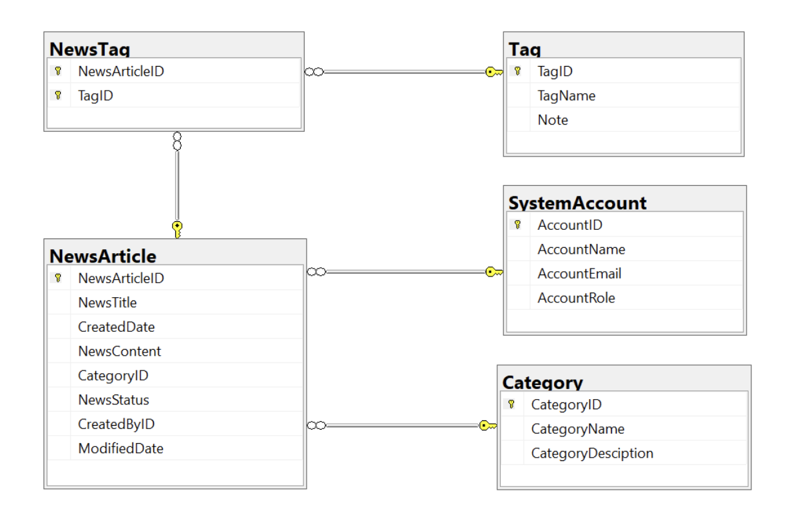

# 📢 News Management System (NMS)

## 1. Introduction

A **News Management System (NMS)** is a software application that helps universities and educational institutions to efficiently manage, organize, and publish news and content to their website and other channels. The NMS typically includes features such as content creation, approval workflow, scheduling, publishing, and analytics. This can help universities to streamline their news operations, improve communication with students and the wider community, and better engage with their target audience.

## 2. Tech Stack

- **.NET 8**
- **WPF**
- **SQL SERVER**

## 3. ERD

## 4. Main Functions

### 🛠️ Admin

- **Manage account information**
- **Create report statistics** by the period from `StartDate` to `EndDate` (based on the news’ creation date), and sort data in descending order.

### 📝 Staff

- **Manage category information**
  - Delete an item if it is not associated with any news articles. Items stored in a news article cannot be deleted.
- **Manage news articles** (including tags)
- **Manage personal profile**
- **View personal news history**

## 5. Demo Videos

## 

---
